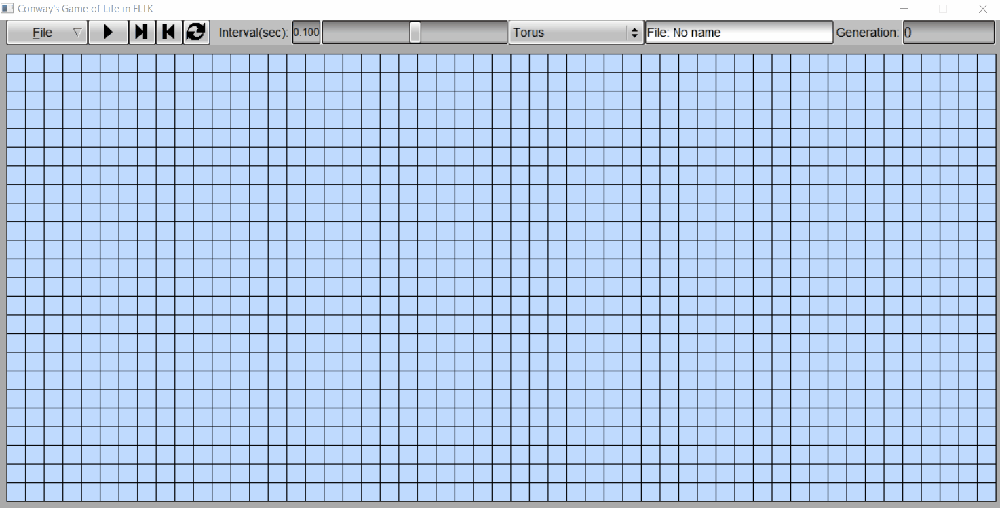
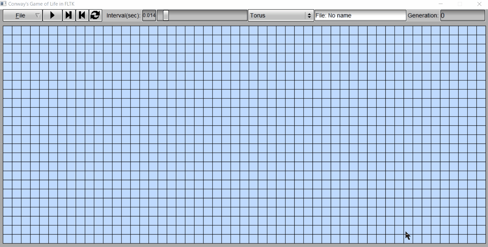
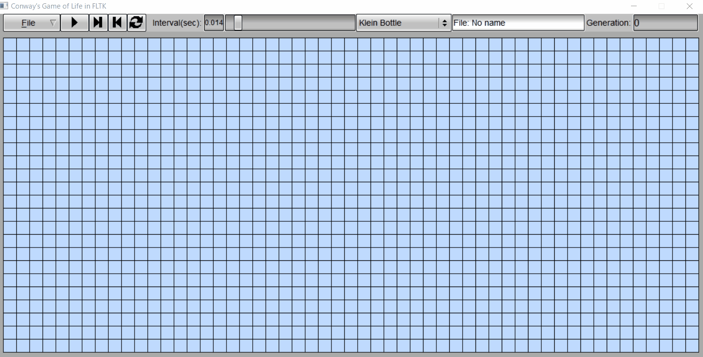
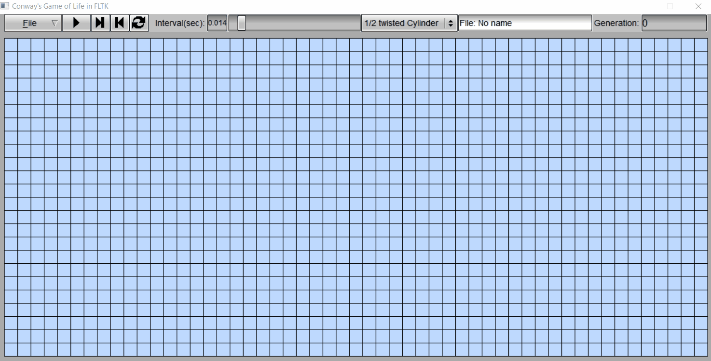

## Conway's Game of Life in FLTK  

### Demo  
4 types of topologies supported : Torus, Klein Bottle, 1/2 twisted Cylinder, 1/3 twisted Torus  

Torus:  
Top and bottom edges correspond, and right and left edges also correspond.    



Klein Bottle:  
Top and bottom edges correspond, and right and left edges are twisted.  



1/2 twisted Cylinder:  
Top and bottom edges correspond, and right edge is connected with the same edge one half twisted, left edge is the same.  




1/3 twisted Torus:  
Top and bottom edges correspond, and right edge is connected with left edge one third twisted.  

 
 
### About Conway's Game of Life 
Conway's Game of Life is a cellular automata.  

Each cell C can be either alive 🔵 or dead ⬜, in a two-dimensional rectangular grid of cells.  
We calculate the sum of live cells in C's eight-location neighbourhood,  
then cell C is alive 🔵 or dead ⬜ in the next generation based on the following diagram:  

   

### Installation (windows)
<ul>
<li>

[mingw-w64](https://mingw-w64.org/doku.php)  
Set path C:\mingw-w64\x86_64-8.1.0-posix-seh-rt_v6-rev0\mingw64\bin   
</li>
<li>

[cmake](https://cmake.org)  
cmake-3.15.2-win64-x64.msi  
Set path C:\CMake\bin  
</li>
<li>

[FLTK](https://www.fltk.org)- Fast Light Tool Kit -  


```
$ tar -xvf fltk-1.3.5-source.tar.gz
$ cd fltk-1.3.5
$ mkdir build
$ cd build
$ cmake -G "MinGW Makefiles" ..
$ mingw32-make.exe 
$ mingw32-make.exe install
```
If   
cmake_install.cmake:36 (file):  
file INSTALL cannot make directory "C:/Pogram Files ..../FLTK/include/FL" Nosuch file or directory  


change `cmake_install.cmake` as follows  

```
# Set the install prefix
if(NOT DEFINED CMAKE_INSTALL_PREFIX)
  set(CMAKE_INSTALL_PREFIX "C:/FLTK/fltk-1.3.5")
endif()
```

change `FLTKConfig.cmake` as follows 
```
#set(FLTK_INCLUDE_DIRS "C:/Program Files (x86)/FLTK/include")
set(FLTK_INCLUDE_DIRS "C:/FLTK/fltk-1.3.5/include")
```
</li>
<li>

[inih](https://github.com/benhoyt/inih)  
Simple .INI file parser in C, good for embedded systems  


</li>

</ul>


### Build   
From this folder  
```
$ mkdir build
$ cd build
$ cmake -G "MinGW Makefiles" ..
$ mingw32-make.exe  
```  
This compiled binary file (lifeGameFLTK.exe) is in **release**.  
Unzip [Conways_Game_of_Life_FLTK-1.0-win64.zip](https://github.com/AkiraHakuta/Conways_Game_of_Life_FLTK/releases)   

### Usage  
```
$ lifeGameFLTK.exe  
```


`lifeGame_flkt.ini`  

``` 
; Please change the following values

[screen]  
cellSize = 22              
width = 53
height = 24  
;height must be a multiple of 6

[color]
alive_color = 216
screen_color = 246
line_color = 56

[font]
font_name = arial
font_size = 14
time_font_size = 16
interval_slider_font_size  = 12
```  

See Demo  


